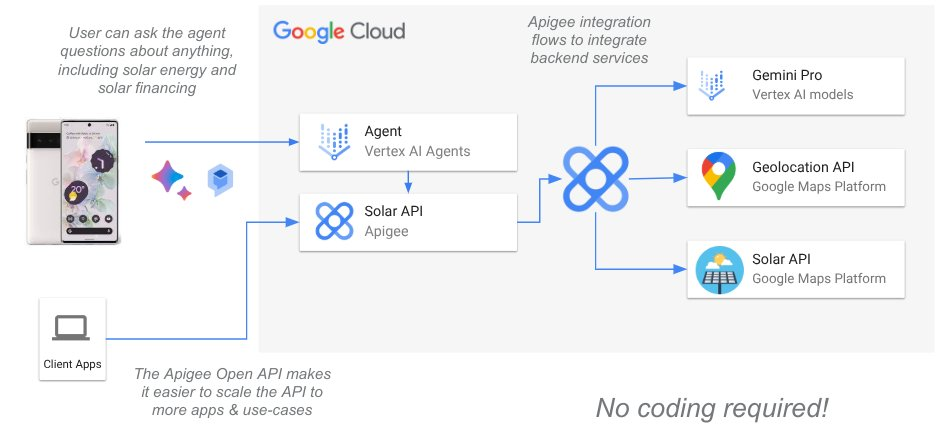

# Apigee Gen AI & Google Maps Solar Demo

In this project we use Google Cloud Apigee to run an API platform for our Gen AI applications. This has two aspects - one the one side we can provide APIs that AI clients can automatically understand and consume, and on the other side we can offer AI models to other applications as managed, secured APIs.

Here is an architecture overview of the solution.



You can go through the deployment steps in your own Google Cloud project by starting the codelab here:

## Prequisites
- You will need a Google Maps API key for this lab. You can get keys here: https://console.cloud.google.com/google/maps-apis/credentials
- You will need to have Apigee provisioned in a Google Cloud project, see here for more information on provisioning: https://cloud.google.com/apigee/docs/api-platform/get-started/provisioning-intro

## Deployment
```sh
# first install / make sure apigeecli is installed
curl -L https://raw.githubusercontent.com/apigee/apigeecli/main/downloadLatest.sh | sh -
export PATH=$PATH:$HOME/.apigeecli/bin

# set your environment info where Apigee is provisioned
PROJECT_ID=YOUR_GCP_PROJECT_ID
REGION=YOUR_GCP_REGION
APIGEE_ENVIRONMENT=YOUR_APIGEE_ENVIRONMENT
GMAPS_KEY=YOUR_GMAPS_KEY

# enable needed APIs for your project
gcloud services enable aiplatform.googleapis.com --project $PROJECT_ID
gcloud services enable solar.googleapis.com --project $PROJECT_ID
gcloud services enable geocoding-backend.googleapis.com --project $PROJECT_ID

# create service account
gcloud iam service-accounts create solarservice \
    --description="Solar service account" \
    --display-name="Solar service" \
    --project $PROJECT_ID

# give service account aiplatform.user rights
gcloud projects add-iam-policy-binding $PROJECT_ID \
--member="serviceAccount:solarservice@$PROJECT_ID.iam.gserviceaccount.com" \
--role="roles/aiplatform.user" \
--project=$PROJECT_ID

# create an Apigee KVM for storing keys, for example the Google Maps API key
apigeecli kvms create -e $APIGEE_ENVIRONMENT -n solar-keys -o $PROJECT_ID -t $(gcloud auth print-access-token)

# store your Google Maps API key in the KVM
apigeecli kvms entries create -m solar-keys -k gmaps_key -l $GMAPS_KEY -e $APIGEE_ENVIRONMENT -o $PROJECT_ID -t $(gcloud auth print-access-token)

# deploy Apigee proxy
cd api-proxies/Solar-Service-v1
apigeecli apis create bundle -f apiproxy --name Solar-Service-v1 -o $PROJECT_ID -t $(gcloud auth print-access-token)
apigeecli apis deploy -n Solar-Service-v1 -o $PROJECT_ID -e $APIGEE_ENVIRONMENT -t $(gcloud auth print-access-token) -s solarservice@$PROJECT_ID.iam.gserviceaccount.com --ovr
cd ../..

# go to the Apigee proxy debug screen, start a debug session, and copy the URL and set it here
URL=YOUR_API_PROXY_URL

# do a test call
curl -X POST "$URL" -i \
-H "Content-Type: application/json" \
--data @- << EOF

{
  "address": "Tucholskystr 2, 10117 Berlin"
}
EOF
# you should get 401 unauthorized, missing API key

# create API product
PRODUCT_NAME="Solar-API-v1"
apigeecli products create -n "$PRODUCT_NAME" \
  -m "$PRODUCT_NAME" \
  -o "$PROJECT_ID" -e $APIGEE_ENVIRONMENT \
  -f auto -p "Solar-Service-v1" -t $(gcloud auth print-access-token)

# create a test developer
DEVELOPER_EMAIL="example-developer@cymbalgroup.com"
apigeecli developers create -n "$DEVELOPER_EMAIL" \
  -f "Example" -s "Developer" \
  -u "$DEVELOPER_EMAIL" -o "$PROJECT_ID" -t $(gcloud auth print-access-token)

# create a test app subscription
APP_NAME=example-app-1
apigeecli apps create --name "$APP_NAME" \
  --email "$DEVELOPER_EMAIL" \
  --prods "$PRODUCT_NAME" \
  --org "$PROJECT_ID" --token $(gcloud auth print-access-token)

# set API_KEY with the consumerKey output value
API_KEY=YOUR_API_KEY

# now call the solar API
curl -X POST "$URL" -i \
-H "Content-Type: application/json" \
-H "x-api-key: $API_KEY" \
--data @- << EOF

{
  "address": "Tucholskystr 2, 10117 Berlin"
}
EOF
# you should get valid solar calculation data from Google Maps

# open the file ./api-specs/solar-api-v1.yaml and replace the servers URL with your URL

# go to Vertex AI Agent Builder, create a new Agent with a tool using the Open API spec that was edited above, test asking questions about solar energy.

# now let's ask the API solar questions as well
curl -X POST "$URL/questions" -i \
-H "Content-Type: application/json" \
-H "x-api-key: $API_KEY" \
--data @- << EOF

{
  "question": "what are the most efficient types of solar panels?"
}
EOF
# you should get an answer from Gemini

# now let's deploy a test web app
cd app
gcloud run deploy solar-app --source . --project $PROJECT_ID --region $REGION --allow-unauthenticated
# after deployment is complete, open the URL displayed to chat with the solar agent widget.
cd ..

# congratulations, you've finished the demo!
```
